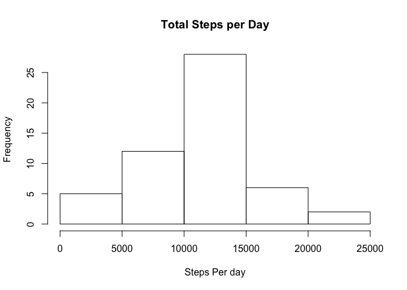

# PA1_template.Rmd
Sammy Q R.  
October 8, 2016  

**Loading and Preprocessing the Data**


```r
stepsData <- read.csv("activity.csv")

stepsData$date <- as.Date(as.character(stepsData$date), format = "%Y-%m-%d") ##turn into date col into date class
```

**What is the mean number of steps taken per day**
1. Calculate total number of steps taken per day 

```r
library("dplyr")
```

```
## Warning: package 'dplyr' was built under R version 3.2.5
```

```
## 
## Attaching package: 'dplyr'
```

```
## The following objects are masked from 'package:stats':
## 
##     filter, lag
```

```
## The following objects are masked from 'package:base':
## 
##     intersect, setdiff, setequal, union
```

```r
day <- group_by(stepsData, date) ##categorize data by date 

sumStepsData <- as.data.frame(summarise(day, steps = sum(steps))) ## turn summarised data into a DF
```

2. Make a histogram of the amount of steps taken each day 

```r
hist(sumStepsData$steps, main = "Total Steps per Day", xlab = "Steps Per day") ##histogram
```



3. Calculate and Report the Mean and Median of the Total Number of steps each day 
Mean

```r
mean(sumStepsData$steps, na.rm=TRUE)
```

```
## [1] 10766.19
```
Median

```r
median(sumStepsData$steps, na.rm = TRUE)
```

```
## [1] 10765
```

**What is the average daily activity pattern**
1. Make a time series plot of the 5 minute interval (x-axis) and the average steps taken, averaged across all days

```r
sumIntervalSteps <- group_by(stepsData, interval)
sumIntervalDF <- as.data.frame(summarise(sumIntervalSteps, meanSteps = mean(steps, na.rm = TRUE)))
  ## make a df that has average steps per interval 
```


```r
plot(sumIntervalDF$interval, sumIntervalDF$meanSteps, type="l", ylab = "Average Steps", xlab="Interval")
```


```r
  ## time series plot 
```

2. Which 5 Minute Interval contains the maximum number of average steps?

```r
filter(sumIntervalDF, meanSteps == max(sumIntervalDF$meanSteps)) ## Interval with Max Steps
```

```
##   interval meanSteps
## 1      835  206.1698
```

**Imputing Missing Values**

1. Calculate and report the total number of missing values within the data set (i.e. total number of rows with NAs)

```r
sum(is.na(stepsData$steps))
```

```
## [1] 2304
```

2. Devise strategy for filling in all the missing values of the dataset: Use mean for that five minute interval 

3. Create a new data set that is equal to the original data set but has the missing values filled in and create a histogram of the new steps per day 

CREATE FUNCTION 

```r
newStepsDF <- as.data.frame(matrix(nrow=nrow(stepsData), ncol=1)) ##create an empty DF 
colnames(newStepsDF) <- "meanSteps" ##rename(newStepsDF, c("V1" = "meanSteps"))
newStepsDF$meanSteps <- as.numeric(as.character(newStepsDF$meanSteps))

imputeNA <- function(dataNA, intervalData) {  ##functioncall
    #newStepsDF$meanSteps[1] <<- 5
            for (i in 1:nrow(dataNA)){##nrow(dataNA)) {       ##for 1 to Row amt in df dataNA
             
                 if(is.na(dataNA$steps[i])) {   ##if the subset row in dataNA$steps[i] is an NA 
                   
                       currentInterval <- dataNA$interval[i]    ##save the interval number in variable
                     
                       rowID <- which(intervalData$interval == currentInterval) ## position in array 
                       
                       newSteps <- intervalData$meanSteps[rowID]    ##takes out steps value of the 
                       
                   newStepsDF$meanSteps[i] <<- newSteps ##impute new steps variable into the steps 
                 }
                  else{ 
                newStepsDF$meanSteps[i] <<- dataNA$steps[i]
              
            }
 
            }
}
```

NEW DF


```r
imputeNA(stepsData, sumIntervalDF) ##run function call with required data

imputedData <- cbind(stepsData, newStepsDF)
imputedData <- select(imputedData, date:meanSteps)
```

New Steps Histogram 


```r
imputedGroupBy<- group_by(imputedData, date) ##group observations by data

tableDataFrame <-(summarize(imputedGroupBy, steps = sum(meanSteps)))

hist(tableDataFrame$steps, xlab = "Steps per Day", main = "Imputed Steps Per Day Data") ## make a histogram 
```


Mean 

```r
mean(tableDataFrame$steps)
```

```
## [1] 10766.19
```

Median

```r
median(tableDataFrame$steps)
```

```
## [1] 10766.19
```

There is no change in the mean but there is a slight change in the median. 

**Are there differences in activity patterns between weekdays and weekends**

Create a factor variable for weekends/weekdays based on imputed data

```r
imputedData$weekdayType <- weekdays(imputedData$date)

for (i in 1:nrow(imputedData)) {   
  
if (imputedData$weekdayType[i] == "Sunday") {
  imputedData$weekdayType[i] <- "Weekend"
 
} 
  
  else if (imputedData$weekdayType[i] == "Saturday") {
    imputedData$weekdayType[i] <- "Weekend"
      }
  
  else {
    imputedData$weekdayType[i] <- "Weekday"
  } 
}  

imputedData$weekdayType <- as.factor(imputedData$weekdayType)
```

Make a panel plot containing a time series plot (i.e. 𝚝𝚢𝚙𝚎 = "𝚕") of the 5-minute interval (x-axis) and the average number of steps taken, averaged across all weekday days or weekend days (y-axis). See the README file in the GitHub repository to see an example of what this plot should look like using simulated data.


```r
library(lattice)

ImputedAggregate <- aggregate(meanSteps ~ interval + weekdayType, imputedData, mean)


xyplot(meanSteps ~ interval| weekdayType , data = ImputedAggregate, layout = c(1,2), type = "l")
```


